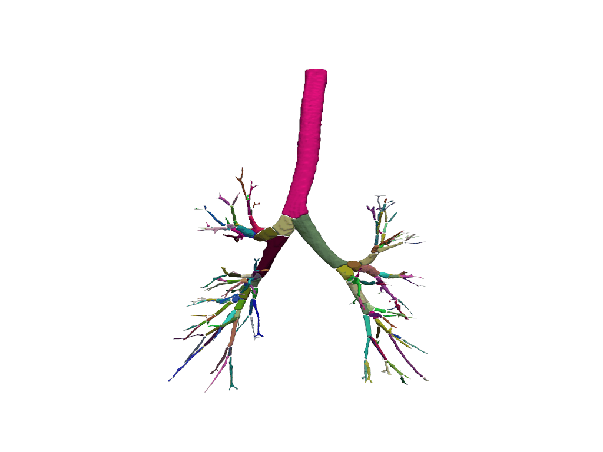

# Airway Tree Parsing

This repository contains code for airway tree parsing using two algorithms: **Ours** and **ATM22**. The goal of the project is to parse the segmented tree into a meaningful representation for further analysis.


## Requirements

- Python 3.11.10
- `numpy`
- `scipy`
- `pyvista`
- `skimage`
- `SimpleITK`
- `cc3d`

You can install the necessary packages via pip:

```bash
pip install -r requirements.txt
```

## Demo

The `./demo_mask/` contains two airway segmentation labels from the training datasets of the [ATM22 challenge](https://github.com/EndoluminalSurgicalVision-IMR/ATM-22-Related-Work) and [AIIB23 challenge](https://github.com/Nandayang/AIIB23).

1. Run ours_skel_parse Only

To run only ours_skel_parse and save the output, use the following command:

```bash
python Main.py --pred_mask_path ./demo_mask/ --save_path ./demo_output_Ours/ --merge_t 5
```
This command will load predicted mask files from `./demo_mask/` and save the processed results to `./demo_output_Ours/`.`--merge_t`: Threshold for merging branches during airway skeleton parsing (default: 5).


2. Run atm22_skel_parse Only

To run only atm22_skel_parse and save the output, use the following command:

```bash
python Main.py --pred_mask_path ./demo_mask/ --save_ATM22_path ./demo_output_ATM22/

```
This command will load predicted mask files from `./demo_mask/` and save the processed results to `./demo_output_ATM22/`.

## Results

The following table summarizes the results of our methods on the provided demo data:

| Method             | Case      | Centerline segment time | Airway tree parse time | Num of branches |
|--------------------|--------------|-----------------------|-------------|---------------|
| Ours    | ATM_001_0000.nii.gz        | 18s                | 13s   | 126        |
| ATM22    | ATM_001_0000.nii.gz        | 30s                | 158s   | 129         |
| Ours | AIIB23_77.nii.gz       | 12s                | 14s   | 183         |
| ATM22 | AIIB23_77.nii.gz       | 36s                | 254s   | 190         |


<div style="text-align: center;">
  
  <div><b>ATM_001_0000 - Ours</b></div>
</div>

<div style="text-align: center;">
  
  <div><b>ATM_001_0000 - ATM22</b></div>
</div>

<div style="text-align: center;">
  
  <div><b>AIIB23_77 - Ours</b></div>
</div>

<div style="text-align: center;">
  
  <div><b>AIIB23_77 - ATM22</b></div>
</div>


## Citation

If you use this project in your research, please cite the following papers:

```bibtex
@article{yang2024multi,
  title={Multi-Stage Airway Segmentation in Lung CT Based on Multi-scale Nested Residual UNet},
  author={Yang, Bingyu and Liao, Huai and Huang, Xinyan and Tian, Qingyao and Wu, Jinlin and Hu, Jingdi and Liu, Hongbin},
  journal={arXiv preprint arXiv:2410.18456},
  year={2024}
}

@article{zhang2023multi,
  title={Multi-site, multi-domain airway tree modeling},
  author={Zhang, Minghui and Wu, Yangqian and Zhang, Hanxiao and Qin, Yulei and Zheng, Hao and Tang, Wen and Arnold, Corey and Pei, Chenhao and Yu, Pengxin and Nan, Yang and others},
  journal={Medical image analysis},
  volume={90},
  pages={102957},
  year={2023},
  publisher={Elsevier}
}
```
