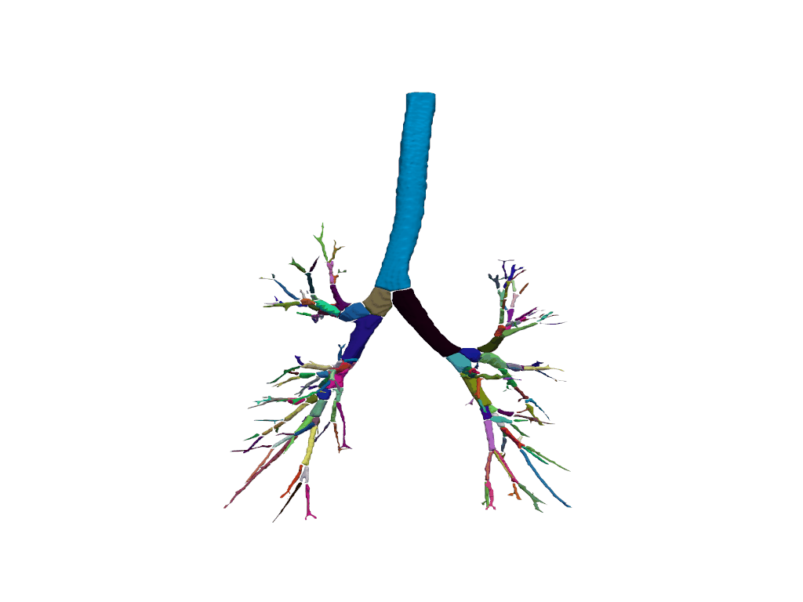
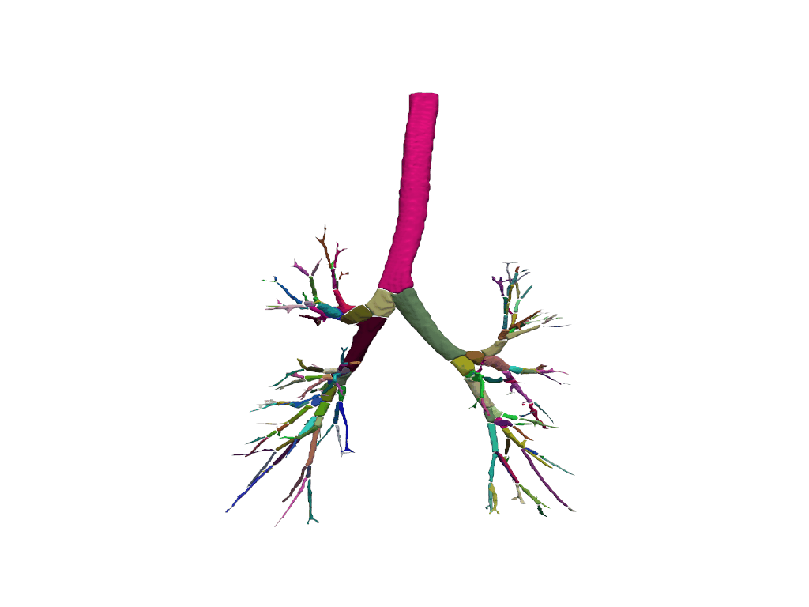
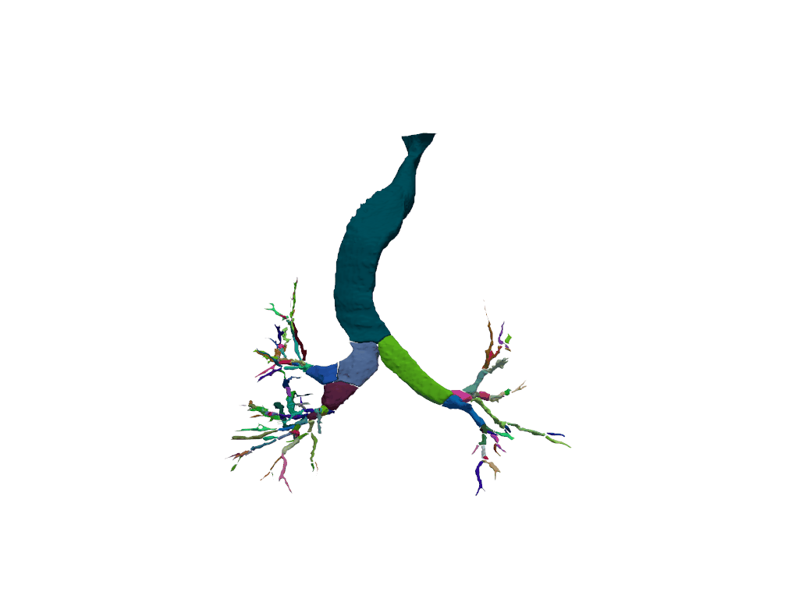
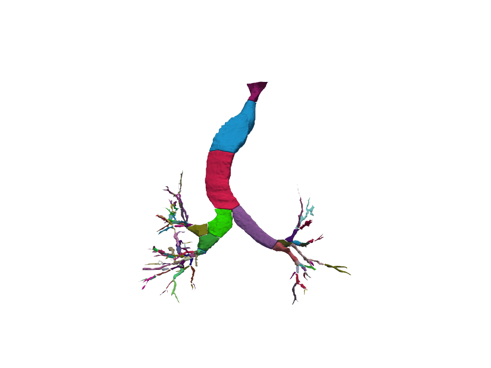

# Airway Tree Parsing

This repository contains code for airway tree parsing using two algorithms: **Ours** and **Wingsnet**. The goal of the project is to parse the segmented tree into a meaningful representation for further analysis.


## Requirements

- Python 3.11.10
- `numpy`
- `scipy`
- `pyvista`
- `skimage`
- `SimpleITK`
- `cc3d`

You can install the necessary packages via pip:

```bash
pip install -r requirements.txt
```

## Demo

The `./demo_mask/` contains two airway segmentation labels from the training datasets of the [ATM22 challenge](https://github.com/EndoluminalSurgicalVision-IMR/ATM-22-Related-Work) and [AIIB23 challenge](https://github.com/Nandayang/AIIB23).

1. Run ours_skel_parse Only

To run only ours_skel_parse and save the output, use the following command:

```bash
python main.py --pred_mask_path ./demo_mask/ --save_path ./demo_output_Ours/ --merge_t 5
```
This command will load predicted mask files from `./demo_mask/` and save the processed results to `./demo_output_Ours/`.`--merge_t`: Threshold for merging branches during airway skeleton parsing (default: 5).


2. Run wingsnet_skel_parse Only

To run only wingsnet_skel_parse and save the output, use the following command:

```bash
python main.py --pred_mask_path ./demo_mask/ --save_Wingsnet_path ./demo_output_Wingsnet/

```
This command will load predicted mask files from `./demo_mask/` and save the processed results to `./demo_output_Wingsnet/`.

## Results

The following table summarizes the results of our methods on the provided demo data:

| Method             | Case      | Centerline segment time | Airway tree parse time | Num of branches |
|--------------------|--------------|-----------------------|-------------|---------------|
| Ours    | ATM_001_0000.nii.gz        | 18s                | 13s   | 126        |
| WingsNet    | ATM_001_0000.nii.gz        | 30s                | 158s   | 129         |
| Ours | AIIB23_77.nii.gz       | 12s                | 14s   | 183         |
| WingsNet | AIIB23_77.nii.gz       | 36s                | 254s   | 190         |










## Citation

If you use this project in your research, please cite the following papers:

```bibtex
@article{yang2024multi,
  title={Multi-Stage Airway Segmentation in Lung CT Based on Multi-scale Nested Residual UNet},
  author={Yang, Bingyu and Liao, Huai and Huang, Xinyan and Tian, Qingyao and Wu, Jinlin and Hu, Jingdi and Liu, Hongbin},
  journal={arXiv preprint arXiv:2410.18456},
  year={2024}
}

@article{zheng2021alleviating,
  title={Alleviating class-wise gradient imbalance for pulmonary airway segmentation},
  author={Zheng, Hao and Qin, Yulei and Gu, Yun and Xie, Fangfang and Yang, Jie and Sun, Jiayuan and Yang, Guang-Zhong},
  journal={IEEE transactions on medical imaging},
  volume={40},
  number={9},
  pages={2452--2462},
  year={2021},
  publisher={IEEE}
}
```
